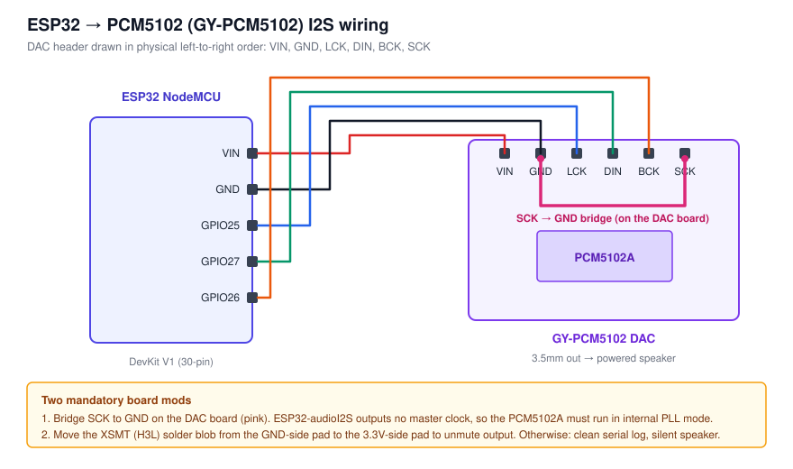

# Wiring



## Connections

| ESP32 pin | PCM5102 pin |
|---|---|
| VIN | VIN |
| GND | GND |
| GPIO25 | LCK |
| GPIO27 | DIN |
| GPIO26 | BCK |

The PCM5102 header's physical pin order, left to right, is:

```
VIN  GND  LCK  DIN  BCK  SCK
```

Any diagram or note you make for this board must follow that **physical order**, not a
signal-function grouping (all-power-then-all-clocks, etc.). Grouping by function produces
something that can't be followed against the real board.

## Mandatory board mod 1 — bridge SCK to GND

`SCK` must be bridged to `GND` **on the DAC board itself**, not run back to the ESP32.

ESP32-audioI2S does not output a master clock, so the PCM5102A has to run in internal PLL
mode, and that mode requires SCK tied low. A floating SCK gives undefined behaviour —
in practice, no audio, with nothing wrong in the serial log.

## Mandatory board mod 2 — move the XSMT (H3L) solder jumper

The GY-PCM5102 has four independent solder jumper groups on the H1L–H4L pads:

| Pad | Group | Change needed |
|---|---|---|
| H1L | FLT | no |
| H2L | DEMP | no |
| H3L | **XSMT** | **yes** |
| H4L | FMT | no |

Only XSMT changes. Move the solder blob from the **GND-side** outer pad to the
**3.3V-side** outer pad to unmute the output.

Silkscreen orientation varies between board batches, so don't trust the printed labels:
**probe the two outer pads with a multimeter first** and bridge to whichever one reads
~3.3 V.

Symptom of skipping this step: a completely healthy serial log — Wi-Fi up, stream
connected, track titles scrolling past — and a totally silent speaker.

## Output

3.5 mm AUX from the DAC into a powered speaker. This is deliberately a wired output rather
than Bluetooth: a Bluetooth output path contends with Wi-Fi for the ESP32's single radio.
